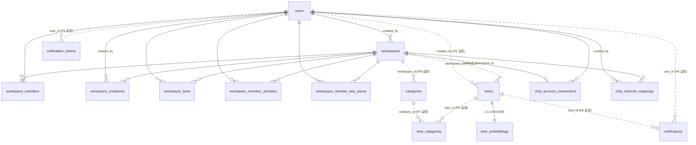

# ERD — 우주인 데이터 모델

> 이 문서는 **`backend/src/main/resources/db/migration/*.sql` (Flyway)** 를 기준으로 작성했습니다.
> 스키마의 소유자는 Flyway이고 Hibernate는 `ddl-auto: validate`로 **검증만** 합니다 — 엔티티와
> 어긋나면 애플리케이션이 기동하지 않습니다. 스키마를 바꿀 때는 마이그레이션 SQL과 엔티티를
> **같은 커밋**에 넣어주세요.
>
> 최종 반영 마이그레이션: `V12__scrub_withdrawn_user_identifiers.sql`

## 목차

- [전체 관계도](#전체-관계도)
- [테이블 상세](#테이블-상세)
  - [계정 · 세션](#계정--세션)
  - [워크스페이스 · 멤버십](#워크스페이스--멤버십)
  - [아이템](#아이템)
  - [카테고리](#카테고리)
  - [임베딩 · 좌표](#임베딩--좌표)
  - [알림](#알림)
  - [메신저 연동](#메신저-연동)
- [인덱스 전략](#인덱스-전략)
- [PostgreSQL에 없는 상태 (Redis)](#postgresql에-없는-상태-redis)
- [설계 결정과 알려진 부채](#설계-결정과-알려진-부채)

---

## 전체 관계도



> **점선(`||..o{`)은 FK 제약이 없는 논리적 관계**입니다. 해당 엔티티가 연관 매핑(`@ManyToOne`)
> 대신 생 id(`Long workspaceId`)를 들고 있어 Hibernate가 FK를 만들지 않았고, 그 스키마를 V1이
> 그대로 옮겼습니다. 자세한 내용은 [알려진 부채](#설계-결정과-알려진-부채)를 보세요.

---

## 테이블 상세

모든 테이블의 `id`는 `bigint GENERATED BY DEFAULT AS IDENTITY`이고, `created_at`/`updated_at`은
`timestamp(6) with time zone`입니다(`BaseTimeEntity`).

### 계정 · 세션

#### `users`

| 컬럼 | 타입 | 제약 | 설명 |
| --- | --- | --- | --- |
| `id` | bigint | PK | |
| `email` | varchar(255) | NOT NULL | ⚠️ UNIQUE 없음 — 중복 검사는 애플리케이션에서만 |
| `password_hash` | varchar(255) | | 소셜 로그인 계정은 NULL |
| `nickname` | varchar(50) | NOT NULL | |
| `provider` | varchar(20) | NOT NULL, CHECK | `LOCAL` / `KAKAO` / `GOOGLE` |
| `provider_id` | varchar(100) | UNIQUE(provider, provider_id) | LOCAL은 NULL |
| `email_verified` | boolean | NOT NULL | |
| `profile_image_url` | text | | |
| `avatar_color` | varchar(20) | NOT NULL, CHECK | 11색 중 하나 (프로필 기본 이미지 색) |
| `personal_workspace_id` | bigint | | 가입 시 생성되는 개인 스페이스 id |
| `personal_tutorial_completed` | boolean | NOT NULL DEFAULT false | 개인 스페이스 최초 안내 |
| `shared_workspace_tutorial_completed` | boolean | NOT NULL DEFAULT false | 공유 워크스페이스 최초 안내 |
| `deleted_at` | timestamptz | | 회원 탈퇴(soft delete). NULL = 활성 |

**탈퇴 처리** — 행을 남기되 로그인 식별자를 파기합니다. `email`은 `withdrawn+{id}@woojuin.invalid`로,
`provider_id`는 NULL로 바꿉니다. 그렇게 하지 않으면 `uk_users_provider`가 같은 구글 계정의
재가입을 영구히 막습니다(V12). `nickname`은 남기지만 화면에는 "탈퇴한 사용자"로 표시됩니다.

> **세션은 이 테이블에 없습니다** — Redis에 있습니다([아래 참고](#postgresql에-없는-상태-redis)).

### 워크스페이스 · 멤버십

#### `workspaces`

| 컬럼 | 타입 | 제약 | 설명 |
| --- | --- | --- | --- |
| `name` | varchar(100) | NOT NULL | |
| `type` | varchar(20) | NOT NULL, CHECK | `PERSONAL`(개인 스페이스) / `TEAM`(공유) |
| `created_by` | bigint | FK → users | |

#### `workspace_members`

| 컬럼 | 타입 | 제약 | 설명 |
| --- | --- | --- | --- |
| `workspace_id`, `user_id` | bigint | FK, UNIQUE(둘) | 한 사람은 워크스페이스당 한 행 |
| `role` | varchar(20) | NOT NULL, CHECK | `OWNER` / `MEMBER` |
| `joined_at` | timestamptz | NOT NULL | |

모든 아이템 접근은 이 테이블의 행 존재로 인가됩니다.

#### `workspace_invitations`

| 컬럼 | 타입 | 제약 | 설명 |
| --- | --- | --- | --- |
| `code` | varchar(64) | UNIQUE | 초대 링크 `/invite/{code}`의 코드 |
| `expires_at` | timestamptz | NOT NULL | |
| `workspace_id`, `created_by` | bigint | FK | |

#### `workspace_bans`

강제 추방 기록. **행의 존재 자체가 재입장 금지**를 뜻합니다. 자진 탈퇴는 여기 들어가지 않습니다.

| 컬럼 | 타입 | 제약 |
| --- | --- | --- |
| `workspace_id`, `user_id` | bigint | FK, UNIQUE(둘) |
| `banned_at` | timestamptz | NOT NULL |

#### `workspace_member_activities`

멤버 활동 피드(표시용 이력). 현재 멤버십(`workspace_members`)이나 금지 여부(`workspace_bans`)와
별개로 "무슨 일이 언제 있었는지"만 남깁니다.

| 컬럼 | 타입 | 제약 | 설명 |
| --- | --- | --- | --- |
| `type` | varchar(20) | NOT NULL, CHECK | `JOINED` / `LEFT` / `KICKED` |
| `occurred_at` | timestamptz | NOT NULL | |
| `workspace_id`, `user_id` | bigint | FK | |

#### `workspace_member_last_seens`

사용자가 멤버 활동 피드를 마지막으로 본 시각. **행이 없으면 "한 번도 확인 안 함"** 입니다.
아이템 쪽 "새 활동" 배지도 이 값을 씁니다.

### 아이템

#### `items`

저장물의 단일 테이블입니다. 타입별 전용 테이블로 쪼개지 않고 nullable 컬럼으로 흡수했습니다.

| 컬럼 | 타입 | 제약 | 설명 |
| --- | --- | --- | --- |
| `workspace_id` | bigint | NOT NULL (FK 없음) | |
| `created_by` | bigint | NOT NULL (FK 없음) | |
| `type` | varchar(10) | NOT NULL, CHECK | `URL` / `IMAGE` / `MEMO` |
| `status` | varchar(15) | NOT NULL, CHECK | `PROCESSING` / `DONE` / `PARTIAL` / `FAILED` |
| `title` | varchar(500) | | AI 생성 또는 사용자 수정 |
| `url` | text | | URL 아이템의 원본 주소 |
| `content` | text | | 메모 본문 / 추출된 본문 / OCR 텍스트 |
| `summary` | text | | AI 한 줄 요약 |
| `preview_thumbnail_url` | text | | 트랙 A 산출물 (og:image → S3 캐시) |
| `preview_description` | text | | 트랙 A 산출물 (og:description) |
| `s3key` | varchar(500) | | IMAGE 원본 |
| `thumbnails3key` | varchar(500) | | IMAGE 목록용 webp 썸네일 |
| `lat`, `lng` | double precision | | 지도 좌표 |
| `address` | varchar(300) | | 역지오코딩 결과 |
| `favorite` | boolean | NOT NULL | |
| `deleted_at` | timestamptz | | 휴지통(soft delete). NULL = 활성 |

**상태 전이**

```
저장 요청 → PROCESSING ─┬─→ DONE     (트랙 A·B 모두 성공)
                        ├─→ PARTIAL  (미리보기는 됐지만 콘텐츠 확보 실패)
                        └─→ FAILED   (재시도 3회 후에도 실패)
```

### 카테고리

#### `categories`

| 컬럼 | 타입 | 제약 | 설명 |
| --- | --- | --- | --- |
| `workspace_id` | bigint | NOT NULL (FK 없음), UNIQUE(workspace_id, name) | |
| `name` | varchar(50) | NOT NULL | |
| `color` | varchar(20) | | 성좌 뷰 별 색 |
| `description` | varchar(500) | | **AI 분류 입력용 판단 기준**. NULL이면 이름으로 폴백 |

워크스페이스 생성 시 기본 11종이 시드됩니다: 생활·할 일 / 학습·지식 / 취업·커리어 / 여행·장소 /
음식·맛집 / 쇼핑·제품 / 건강·운동 / 문화·콘텐츠 / 돈·재테크 / 아이디어·영감 / **기타**.

- 사용자는 추가·이름변경·삭제할 수 있습니다. 단 **`기타`는 삭제 불가** — 분류 실패 시 폴백 대상이라 항상 존재해야 합니다
- AI는 이 고정 목록이 아니라 **그 시점 워크스페이스에 존재하는** 카테고리 중에서만 고릅니다(새 카테고리를 만들지 않습니다)

#### `item_categories`

아이템 ↔ 카테고리 **N:M** 조인 테이블. `UNIQUE(item_id, category_id)`.
한 아이템에 붙는 카테고리 수는 AI 분류 설정(`CATEGORY_MAX_RESULTS`, 기본 2)이 상한입니다.

### 임베딩 · 좌표

#### `item_embeddings`

**JPA 엔티티가 아닙니다** — `vector(1536)`을 Hibernate 관리 아래 두면 매 기동마다 타입 재검사
경로에 들어가고, 접근 패턴이 전부 단건 upsert / 워크스페이스 벌크 조회라 JPA의 이점도 없습니다.
유사도 검색은 pgvector 연산자(`<=>`)를 쓰는 네이티브 SQL입니다.

| 컬럼 | 타입 | 제약 | 설명 |
| --- | --- | --- | --- |
| `item_id` | bigint | **PK**, FK → items **ON DELETE CASCADE** | 아이템당 임베딩 하나 |
| `workspace_id` | bigint | NOT NULL | 벌크 조회를 위해 중복 보관 |
| `embedding` | vector(1536) | NOT NULL | `text-embedding-3-small` |
| `embedding_model` | varchar(100) | | 재생성 판단용 |
| `input_hash` | varchar(100) | | 임베딩 텍스트 해시 — 같으면 재호출하지 않음 |
| `x`, `y`, `z` | double precision | | UMAP 3차원 좌표. **nullable** = "임베딩은 있고 좌표 재계산 전" |
| `updated_at` | timestamptz | NOT NULL DEFAULT now() | |

> 휴지통(soft delete)은 이 행을 남깁니다 — 조회 쪽에서 `items.deleted_at`으로 거릅니다.
> **영구 삭제**에서만 CASCADE로 함께 사라집니다.

**좌표 재계산** — 새 아이템의 임베딩을 만든 뒤, 같은 워크스페이스의 기존 임베딩과 함께
ai-mix `/v1/coordinates/reduce`에 넘겨 전부 다시 축소하고 한 트랜잭션에서 갱신합니다.
표본이 5개 미만이면 UMAP 대신 PCA로 폴백합니다.

### 알림

#### `notifications`

인앱 알림함. 아이템 처리 완료(`DONE`/`PARTIAL`) 시 생성됩니다.

| 컬럼 | 타입 | 설명 |
| --- | --- | --- |
| `user_id`, `item_id` | bigint | FK 없음 |
| `message` | varchar(255) | |
| `created_at` | timestamptz | |

#### `notification_tokens`

FCM 웹 푸시 기기 토큰 (User : Token = 1:N).

| 컬럼 | 타입 | 제약 | 설명 |
| --- | --- | --- | --- |
| `user_id` | bigint | NOT NULL (FK 없음) | |
| `token` | varchar(255) | **UNIQUE** | 기기/브라우저 설치 단위. 같은 토큰 재등록 시 소유자만 갱신 |
| `device_info` | varchar(255) | | |

### 메신저 연동

#### `chat_account_connections`

메신저 계정 ↔ 우주인 계정 연결.

| 컬럼 | 타입 | 제약 | 설명 |
| --- | --- | --- | --- |
| `platform` | varchar(20) | NOT NULL, CHECK | `DISCORD` / `MATTERMOST` |
| `external_user_id` | varchar(100) | UNIQUE(platform, external_user_id) | 메신저 쪽 사용자 id |
| `user_id` | bigint | FK → users, UNIQUE(platform, user_id) | 플랫폼당 한 계정만 연결 |
| `default_workspace_id` | bigint | FK → workspaces | 채널 매핑이 없을 때의 저장 대상 |
| `oauth_access_token` / `oauth_refresh_token` / `oauth_expires_at` | text / text / timestamptz | | Mattermost OAuth (암호화 저장) |

#### `chat_channel_mappings`

채널 ↔ 워크스페이스 매핑. 매핑이 있으면 그 채널의 저장은 해당 워크스페이스로 갑니다.

| 컬럼 | 타입 | 제약 |
| --- | --- | --- |
| `platform` | varchar(20) | NOT NULL, CHECK (`DISCORD`/`MATTERMOST`) |
| `channel_id` | varchar(100) | UNIQUE(platform, channel_id) |
| `workspace_id` | bigint | FK → workspaces **ON DELETE CASCADE** |
| `created_by` | bigint | FK → users |

---

## 인덱스 전략

텍스트 검색 전용 인덱스(FTS·GIN)는 **없습니다**. 검색은 아래 부분 인덱스로 대상을 좁힌 뒤
텍스트 컬럼을 훑고, 키워드가 0건이면 pgvector 유사도로 넘어갑니다.

| 인덱스 | 정의 | 근거 |
| --- | --- | --- |
| `idx_items_ws_active` | `(workspace_id, created_at DESC) WHERE deleted_at IS NULL` | 목록·검색의 기본 경로. `deleted_at`을 인덱스 컬럼이 아니라 **WHERE 조건**으로 뺀 것이 핵심 — 컬럼으로 넣으면 정렬 보장이 깨져 Bitmap 스캔 + Sort로 떨어지고 `LIMIT 28`인데도 활성 아이템을 전부 읽습니다 (20만 건/대상 1만 건 기준 **6.4ms → 0.19ms**) |
| `idx_items_ws_geo` | `(workspace_id) WHERE lat IS NOT NULL AND lng IS NOT NULL AND deleted_at IS NULL` | 좌표 보유 아이템은 소수라 인덱스가 아주 작아집니다. 좌표를 별도 테이블로 분리하지 않아도 되는 근거 |
| `idx_item_embeddings_ws` | `(workspace_id)` | 좌표 재계산·의미 검색의 워크스페이스 벌크 조회 |
| `idx_workspace_member_activities_ws_occurred` | `(workspace_id, occurred_at DESC)` | 활동 피드 |
| `idx_chat_account_connections_user`, `idx_chat_channel_mappings_creator` | `(user_id)`, `(created_by)` | 마이페이지 연동 목록 |

> 휴지통 조회(`deleted_at IS NOT NULL`)는 부분 인덱스를 쓰지 못합니다 — 저트래픽이라 감수한 선택입니다.

### ⚠️ `items`에 GENERATED 컬럼을 추가하지 마세요

`ddl-auto`가 남아 있는 환경에서 `content`의 타입 변경 ALTER가 거부돼 **두 번째 기동부터 앱이
뜨지 않습니다**(PostgreSQL이 생성 컬럼이 참조하는 컬럼의 타입 변경을 거부). 필요하면 표현식
인덱스를 쓰세요.

---

## PostgreSQL에 없는 상태 (Redis)

수명이 짧거나 조회 패턴이 단순한 상태는 DB에 두지 않았습니다.

| 키 | 용도 |
| --- | --- |
| `sessions:{sid}` | 로그인 세션(기기명·생성/최근사용 시각). 마이페이지 "연결된 기기" |
| `revoked-session:{sid}` | 세션 강제 종료 표시 |
| `device-link:{code}` | 워치 로그인용 6자리 코드 ↔ 승인 상태·토큰 |
| `woojuin:chat-link:{code}` | 메신저 계정 연결용 코드 |
| `woojuin:chat-command:{requestId}` | 메신저 슬래시 명령 중복 처리 방지 |
| `woojuin:ai-usage:monthly:{...}` | 월별 AI 처리 건수 카운터 (기본 상한 500건/월) |
| `woojuin:ai-usage:reservation:{...}` | 저장 실패 시 카운터를 되돌리기 위한 짧은 예약 |
| `woojuin:ai-usage:unlimited-users` | 사용량 제한 예외 사용자 집합 |
| `presigned-url:{...}` | S3 presigned URL 캐시 |
| `woojuin:item-processing` (**Stream**) | 아이템 가공 큐. 컨슈머 그룹 `ai-workers`, 컨슈머 3, 최대 배달 3회 |

---

## 설계 결정과 알려진 부채

### 결정

1. **아이템 단일 테이블** — `URL`/`IMAGE`/`MEMO`를 타입별 테이블로 쪼개지 않았습니다. 목록·검색·지도가 전부 타입 무관 조회라 쪼개면 매번 UNION이 됩니다
2. **좌표는 `items` 컬럼** — 부분 인덱스(`idx_items_ws_geo`)가 작아서 별도 테이블의 이점이 없습니다
3. **임베딩만 별도 테이블** — 1536차원 벡터는 목록 조회에 전혀 필요 없는데 `items`에 두면 매 조회에서 읽히거나 별도 projection이 강제됩니다
4. **soft delete 2종** — `items.deleted_at`(휴지통), `users.deleted_at`(회원 탈퇴). 둘 다 조회 계층에서 거릅니다
5. **`ai_results` 테이블은 없습니다** — 설계 노트에 있었지만 만들어진 적이 없습니다. AI 산출물(`summary`)과 좌표(`lat`/`lng`/`address`)는 모두 `items`에 있습니다

### 부채 (백로그)

| 항목 | 영향 |
| --- | --- |
| `users.email`에 UNIQUE 없음 | 동시 요청이 겹치면 같은 이메일의 LOCAL 계정이 둘 생길 수 있음. `CREATE UNIQUE INDEX ... WHERE provider = 'LOCAL'` 검토 |
| `items`, `categories`, `item_categories`, `notifications`, `notification_tokens`에 FK 없음 | 엔티티가 생 id를 쓰는 매핑의 결과. 특히 조인 테이블에 FK가 없어 아이템/카테고리 영구 삭제 시 연결 행이 남을 수 있음. 추가하려면 기존 고아 행 정리가 선행 필요 |
| CHECK 제약이 enum을 하드코딩 | enum에 값을 추가하면 마이그레이션으로 CHECK도 함께 늘려야 합니다. 빠뜨리면 **기동은 정상인데 저장 시점에** 제약 위반으로 실패합니다 |

---

## 관련 문서

- [요구사항 명세서](REQUIREMENTS.md) — 이 스키마가 지탱하는 기능
- [API 명세서](API.md) — 이 스키마를 노출하는 엔드포인트
- [기획서](PLANNING.md) — 왜 이렇게 나눴는지
